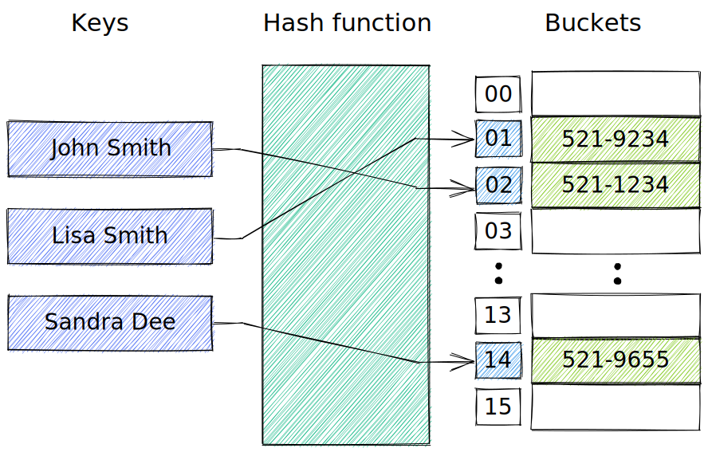

# Hash table (hash map)

> In [[Computing|computing]], a hash table, also known as hash map, is a
> [[Data_structure]] that implements an [[Associative_array]] or dictionary. It
> is an abstract data type that maps keys to values. A hash table uses a hash
> function to compute an index, also called a hash code, into an array of
> buckets or slots, from which the desired value can be found. During lookup,
> the key is hashed and the resulting hash indicates where the corresponding
> value is stored.
>
> Ideally, the hash function will assign each key to a unique bucket, but most
> hash table designs employ an imperfect hash function, which might cause hash
> collisions where the hash function generates the same index for more than one
> key. Such collisions are typically accommodated in some way.
>
> — <cite>[Wikipedia](https://en.wikipedia.org/wiki/Hash_table)</cite>

| Algorithm | Average | Worst case |
| --------- | ------- | ---------- |
| Space     | Θ(n)    | O(n)       |
| Search    | Θ(1)    | O(n)       |
| Insert    | Θ(1)    | O(n)       |
| Delete    | Θ(1)    | O(n)       |

_A small phone book as a hash table_
