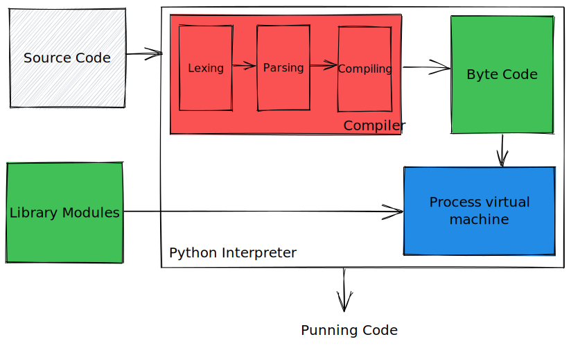

# Interpreter (computing)

> In computer science, an interpreter is a computer program that directly
> executes instructions written in a programming or scripting language, without
> requiring them previously to have been compiled into a machine language
> program.
>
> An interpreter generally uses one of the following strategies for program
> execution:
>
> - Parse the source code and perform its behavior directly;
> - Translate source code into some efficient intermediate representation or
>   object code and immediately execute that;
> - Explicitly execute stored precompiled [[Bytecode]] made by a compiler and
>   matched with the interpreter Virtual Machine.

Here example how [[Python]] does it:

## Resources

- [ ] [Crafting Interpreters](http://craftinginterpreters.com/contents.html)

