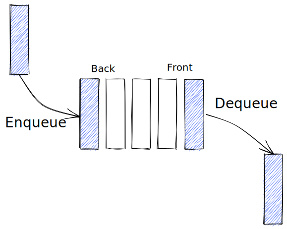

# Queue (abstract data type)

> In [[Computer_science]], a queue is a **collection of entities** that are
> maintained in a sequence and can be modified by the addition of entities at
> one end of the sequence and the removal of entities from the other end of the
> sequence. By convention, the end of the sequence at which elements are added
> is called the back, tail, or rear of the queue, and the end at which elements
> are removed is called the head or front of the queue, analogously to the words
> used when people line up to wait for goods or services.
>
> The operation of adding an element to the rear of the queue is known as
> enqueue, and the operation of removing an element from the front is known as
> dequeue. Other operations may also be allowed, often including a peek or front
> operation that returns the value of the next element to be dequeued without
> dequeuing it.
>
> The operations of a queue make it a first-in-first-out (**FIFO**) data
> structure. In a FIFO data structure, the first element added to the queue will
> be the first one to be removed. This is equivalent to the requirement that
> once a new element is added, all elements that were added before have to be
> removed before the new element can be removed. A queue is an example of a
> linear data structure, or more abstractly a sequential collection. Queues are
> common in computer programs, where they are implemented as data structures
> coupled with access routines, as an abstract data structure or in
> object-oriented languages as classes. Common implementations are circular
> buffers and linked lists.
>
> -- [Wikipedia](https://en.wikipedia.org/wiki/Queue_\(abstract_data_type\))

| Algorithm | Average | Worst case |
| --------- | ------- | ---------- |
| Space     | O(n)    | O(n)       |
| Search    | O(n)    | O(n)       |
| Insert    | O(1)    | O(1)       |
| Delete    | O(1)    | O(1)       |

_Representation of a FIFO queue_
