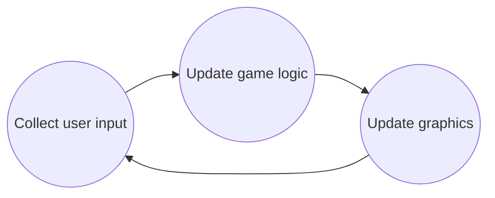

   
Classic “game engine main loop”   
?   

   
<!--SR:!2023-04-27,1,230-->   
   
Probably hardest and time-consuming part in game development is?   
?   
Integration content into the game (but it can differ from game to game)   
   
Core godot engine components   
?   
2D, 3D, Physics, Audio, Input, UI, Networking, Scripting, etc.   
   
Fundamental godot blocks   
?   
Nodes, Scenes, Resources, Signals, etc.   
   
## Hour 1, "Introduction to Godot Engine"