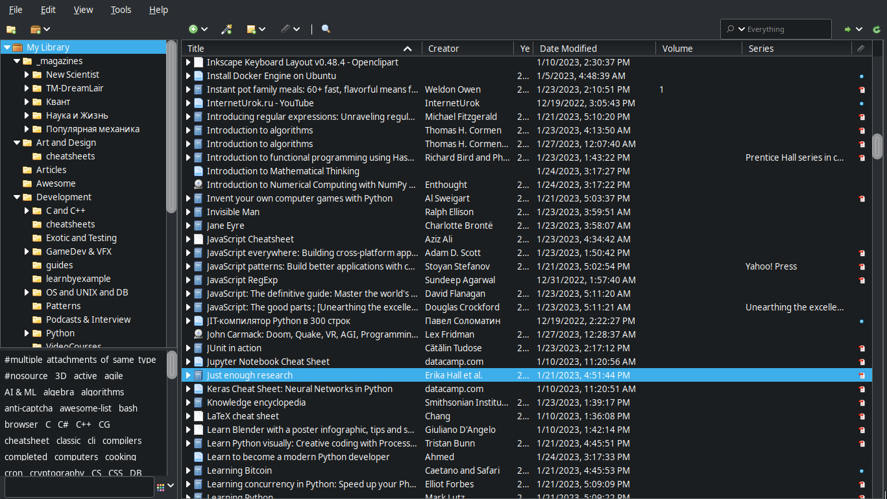

   
   
*Zotero main window*   
   
Zotero - free citation manager, it's contains a lot of features, such as:   
   
   
- UI to manage your references;   
- zotero importer to import references from websites (useful to import   
  references from Google Scholar, Amazon, etc.);   
   
- rich plugin system to extend Zotero's functionality (rename files, translate   
  in PDF viewer, etc.);   
   
- built-in PDF viewer and annotator;   
- API to extend Zotero's functional.   
   
I use it to store my [literature](./literature.md): books, articles, education   
resources, cheatsheets, feeds, etc.   
   
Zotero has advanced search capabilities, you can search by author, title, year,   
tags, etc. It's also indexing your references, so you can search by content (PDF   
only).   
   
Using syncthing and "Zoo for Zotero" you can sync your references between PC and   
android devices. Zoo for Zotero allow set a custom attachment folder, so you can   
sync your attachments too (use syncthing to sync zotero attachments directory).   
   
Better BibTeX is a plugin for Zotero that allows you to export your references   
to BibTeX format. It's useful to use with LaTeX, integrate with your favorite   
tool, etc. I use [neovim (text editor)](./neovim%20%28text%20editor%29.md) telescope BibTeX plugin to quickly add   
references to my [notes](./notes%20types.md).   
   
## Plugins   
   
Zotfile - useful to rename attachments, shortcut <kbd>M-r</kbd> to rename   
attachments. Mdnotes - useful to generate markdown notes from references,   
shortcut <kbd>M-n</kbd> to generate notes.   
   
## TOC   
   
   
- [ ] zotero pre-commit hook replace absolute paths   
- [ ] zotero password recover android   
- [ ] zotero documentation update   
- [ ] need link all this :: To generate TOC I use pdftoc.sh script, its use   
pdftocgen to generate TOC and [gnu sed](./gnu%20sed.md) to add heading markup   
rules. It's work more stable than built-in TOC generator.   
   
Then I can easily add TOC to my research notes.